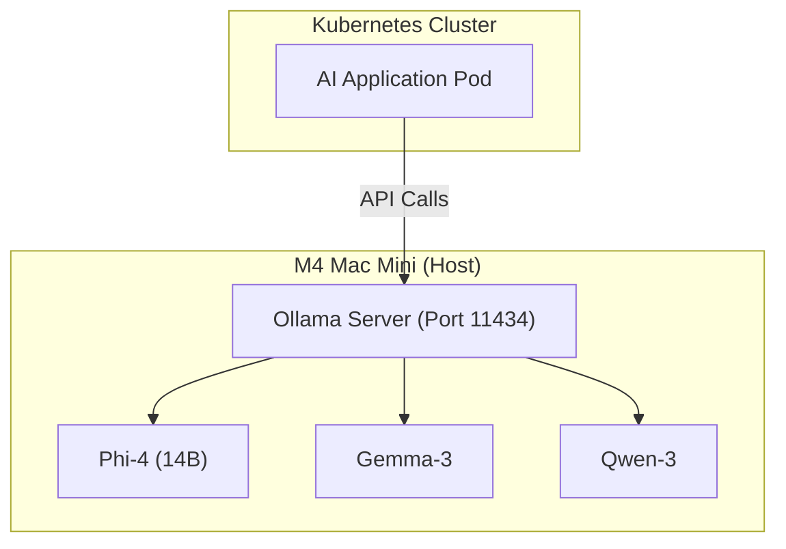

# AI Infrastructure Design

EdgeOps Labs is designed to experiment with AI infrastructure while avoiding expensive cloud GPU costs.

## Architecture

We use a hybrid local-cloud approach for AI inference:

## Key Principles

1. **Keep Inference Local**: The M4 Mac Mini has 16GB of unified memory, which is excellent for running models up to 14B parameters efficiently.
2. **Avoid Cloud GPUs**: Running GPU nodes in AKS/EKS is prohibitively expensive for homelab environments.
3. **API-First Integration**: Applications running in the cluster interact with models via standard OpenAI-compatible REST APIs provided by Ollama.

## Connectivity

- **Local (Kind)**: Pods connect to Ollama via `host.docker.internal:11434`.
- **Cloud (AKS/EKS)**: Pods connect back to the Mac Mini via a secure Tailscale tunnel or VPN.
