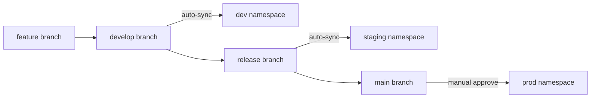

# GitOps Design

## Philosophy

> Git is the single source of truth for the desired state of the system.

## Flow


## App-of-Apps Pattern

ArgoCD uses the App-of-Apps pattern where a single root application manages all other applications:

```
gitops-platform/
├── bootstrap/
│   └── root-app.yaml          # Root ArgoCD application
├── applications/
│   ├── demo-app-dev.yaml      # Demo app → dev namespace
│   ├── demo-app-staging.yaml  # Demo app → staging namespace
│   └── demo-app-prod.yaml     # Demo app → prod namespace
├── platform-services/
│   ├── ingress-nginx.yaml     # NGINX Ingress Controller
│   ├── kyverno.yaml           # Policy engine
│   └── monitoring.yaml        # Observability stack
└── environments/
    ├── dev/                   # Dev-specific patches
    ├── staging/               # Staging-specific patches
    └── prod/                  # Prod-specific patches
```

## Environment Promotion



## Sync Policies

| Environment | Sync Mode | Prune | Self-Heal |
|-------------|-----------|-------|-----------|
| dev | Automated | Yes | Yes |
| staging | Automated | Yes | Yes |
| prod | Manual (require approval) | Yes | Yes |
