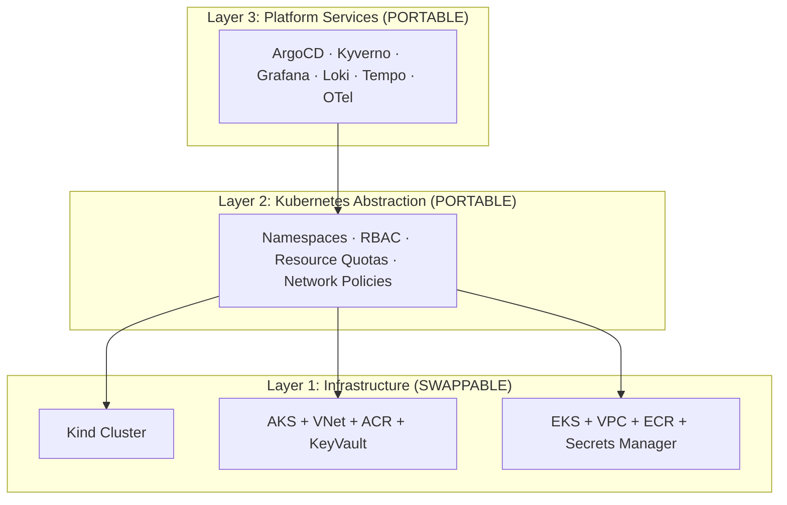

# Multi-Cloud Architecture

The EdgeOps Labs Platform is designed using a 3-layer cloud-agnostic architecture. This allows us to move from local development to Azure (AKS) and AWS (EKS) without rewriting platform services.

## The 3-Layer Abstraction

## Infrastructure Modules Contract

All Kubernetes infrastructure modules must expose a strict "Contract Interface" regardless of the underlying cloud provider:

| Output | Description |
|--------|-------------|
| `cluster_name` | Name of the cluster |
| `cluster_endpoint` | K8s API server URL |
| `kubeconfig_path` | Path to kubeconfig (local dev) |
| `cluster_ca_certificate` | CA certificate |
| `client_certificate` | Client cert |
| `client_key` | Client key |

By adhering to this contract, the environment layers (`local`, `azure-dev`, `aws-dev`) can swap modules while the rest of the stack remains untouched.

## Phase 1: Local (Kind)
Zero cost, local development. Validates Kubernetes, OpenTofu, and ArgoCD workflows.

## Phase 2: Azure (AKS)
First cloud target. Uses Azure VNet, AKS Free Tier, and Basic ACR to stay within a strict $100/mo budget.

## Phase 3: AWS (EKS)
Second cloud target. Migrates the same ArgoCD GitOps repository to EKS.
