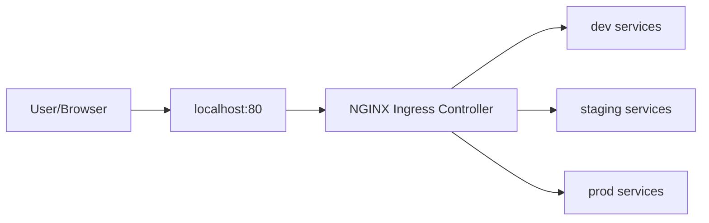

# Networking Design

## Overview

Traffic enters the EdgeOps Labs cluster through NGINX Ingress Controller deployed on the control-plane node with hostPort mappings.

## Traffic Flow

## Port Mappings

| Host Port | Container Port | Service |
|-----------|---------------|---------|
| 80 | 80 | HTTP Ingress |
| 443 | 443 | HTTPS Ingress |
| 30080 | 30080 | ArgoCD UI (NodePort) |

## DNS Strategy

For local development, we use `nip.io` for automatic DNS resolution:

- `dev.127.0.0.1.nip.io` → dev namespace
- `staging.127.0.0.1.nip.io` → staging namespace
- `prod.127.0.0.1.nip.io` → prod namespace
- `argocd.127.0.0.1.nip.io` → ArgoCD UI

## Network Policies

Each namespace has default-deny ingress policies with explicit allow rules for:

1. Ingress controller → application pods
2. Inter-service communication within namespace
3. Monitoring scrape endpoints (Prometheus)
