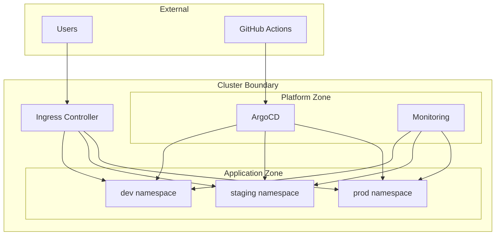

# Security Design

## Zero Trust Principles

> Trust Nothing. Verify Everything.

## Trust Boundaries

## Security Controls

| Layer | Control | Tool |
|-------|---------|------|
| Admission | Policy enforcement | Kyverno |
| Network | Namespace isolation | NetworkPolicies |
| Identity | Service accounts | Kubernetes RBAC |
| Secrets | Encrypted at rest | Sealed Secrets / SOPS |
| Images | Vulnerability scanning | Trivy |
| Supply Chain | Image signing | Cosign |

## Kyverno Policy Roadmap

| Week | Policy | Scope |
|------|--------|-------|
| Week 1 | Mandatory labels | All namespaces |
| Week 2 | Resource limits required | All namespaces |
| Week 3 | Non-root containers | Application namespaces |
| Week 4 | Image tag restrictions (no `:latest`) | All namespaces |
