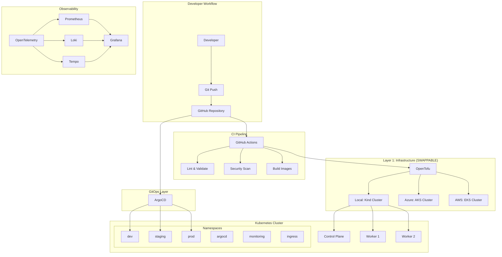

# System Overview

## Purpose

The EdgeOps Labs Platform solves the problem of demonstrating production-grade cloud-native platform engineering practices in a cost-efficient homelab environment.

## High-Level Architecture

## Design Principles

1. **Infrastructure as Code**: All infrastructure is defined declaratively in OpenTofu
2. **GitOps**: Git is the single source of truth for desired state
3. **Separation of Concerns**: Infrastructure, applications, and platform services are managed independently
4. **Least Privilege**: RBAC and network policies enforce minimal access
5. **Observability by Default**: Every component is instrumented
6. **Progressive Delivery**: Changes flow through dev → staging → prod

## Platform Portability Roadmap

This platform is intentionally designed to demonstrate cloud-agnostic architecture. The infrastructure layer is cleanly decoupled from the Kubernetes workload layer, allowing the platform to migrate seamlessly across providers.

**The Multi-Cloud Journey:**
1. **Phase 1 (Complete)**: Local validation via `Kind`
2. **Phase 2 (Complete)**: Cloud deployment via `Azure AKS`
3. **Phase 3 (Future)**: Provider abstraction expansion to `AWS EKS`

*This explicitly demonstrates Platform Engineering maturity by enabling workloads to port seamlessly from local dev to Azure and eventually AWS, governed purely by GitOps and OpenTofu provider abstractions.*

## Component Responsibilities

| Component | Manages | Does NOT Manage |
|-----------|---------|-----------------|
| OpenTofu | Cluster, namespaces, RBAC, quotas | Application deployments |
| ArgoCD | Application lifecycle, environment promotion | Infrastructure provisioning |
| GitHub Actions | CI (lint, test, scan, build) | CD (handled by ArgoCD) |
| Kyverno | Policy enforcement, admission control | Application logic |
| Prometheus | Metrics collection, alerting rules | Log storage |
| Grafana | Visualization, dashboards | Data collection |
