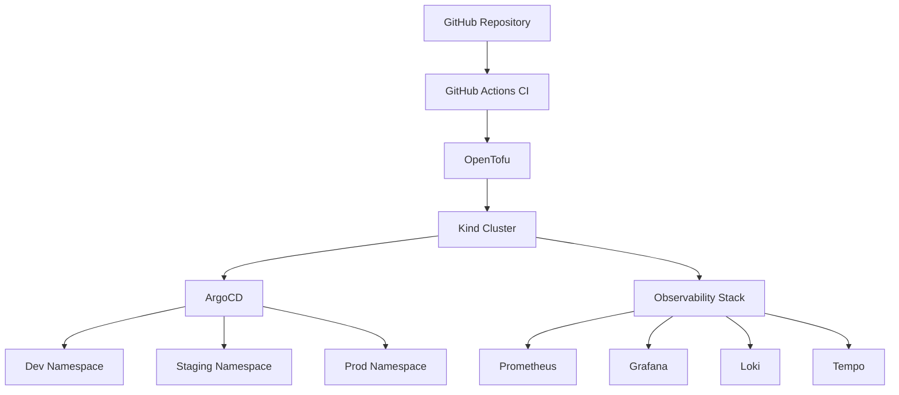

# EdgeOps Labs Platform

Welcome to the **EdgeOps Labs Platform** documentation portal — a production-inspired cloud-native platform engineering reference architecture.

## What is EdgeOps Labs?

EdgeOps Labs is a comprehensive platform that demonstrates:

- 🏗️ **Infrastructure as Code** — OpenTofu modules for reproducible infrastructure
- 🔄 **GitOps** — ArgoCD-driven deployments from Git as single source of truth
- 🛠️ **Platform Engineering** — Self-service namespaces, guardrails, golden paths
- ☸️ **Kubernetes Operations** — Multi-environment cluster management
- 📊 **Observability** — Prometheus, Grafana, Loki, Tempo, OpenTelemetry
- 🛡️ **Security** — Zero Trust, Kyverno policies, image scanning, RBAC

## Architecture

## Quick Navigation

| Section | Description |
|---------|-------------|
| [Architecture](architecture/system-overview.md) | System design and component interactions |
| [Operations](operations/sop-001-cluster-creation.md) | Standard Operating Procedures |
| [Security](security/policies.md) | Security policies and Kyverno rules |
| [Onboarding](onboarding/getting-started.md) | Getting started guide |

## Technology Stack

| Layer | Technology | Purpose |
|-------|-----------|---------|
| IaC | OpenTofu | Infrastructure provisioning |
| Container Runtime | Docker + Kind | Local Kubernetes clusters |
| Orchestration | Kubernetes | Container orchestration |
| GitOps | ArgoCD | Declarative deployments |
| Ingress | NGINX Ingress | Traffic routing |
| Policy Engine | Kyverno | Admission control |
| Metrics | Prometheus | Metric collection |
| Visualization | Grafana | Dashboards |
| Logging | Loki | Log aggregation |
| Tracing | Tempo | Distributed tracing |
| Instrumentation | OpenTelemetry | Unified telemetry |
